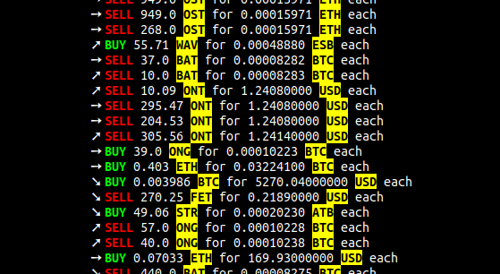

TOOL FOR CRYPTO-CAPITALIST MUSIC
================================

Get live trades from cryptocurreny marketplaces, and send OSC commands to a server. Tought to be used with Tidal Cycles.

OSC commands examples
---------------------
```
/ctrl [QTY, 53.67] # number of currency unit traded
/ctrl [PRICE, 0.11254] # unitary price of the base currency in the quote currency
/ctrl [BIGCHANGE, 2] # one thousand times the change ratio since the last trade between the two same currencies
```

Requirements
------------
Python 3
```bash
pip install -r requirements.txt
```

Usage
-----
```bash
python love💲.py`
```



Sources of data
---------------
- https://docs.pro.coinbase.com/#websocket-feed
- https://github.com/binance-exchange/binance-official-api-docs/blob/master/web-socket-streams.md

To do
-----
- Add other source ?
- Send other commands ?

Hack me
-------
Yes.